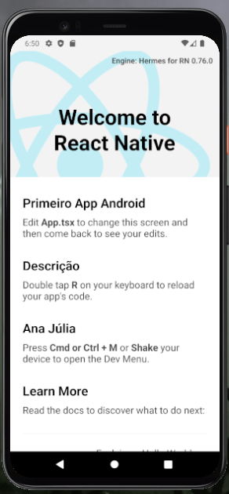

# Teste Android

      
          
Precisei fazer um teste pra ver se todas as funções do react e do android studio estavam funcionando para desenvolver um projeto futuro chamado Cardápio Online e aqui está o resultado:

Documentação oficial do React: https://reactnative.dev/docs/environment-setup

Como instalei o React: https://www.youtube.com/watch?v=fCLMhg8byi8&t=1824s

# License

